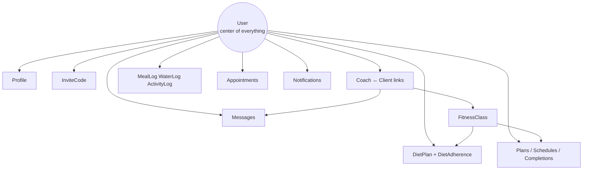
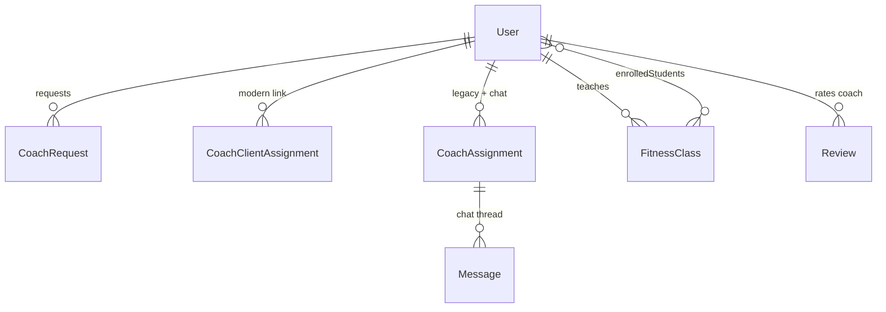
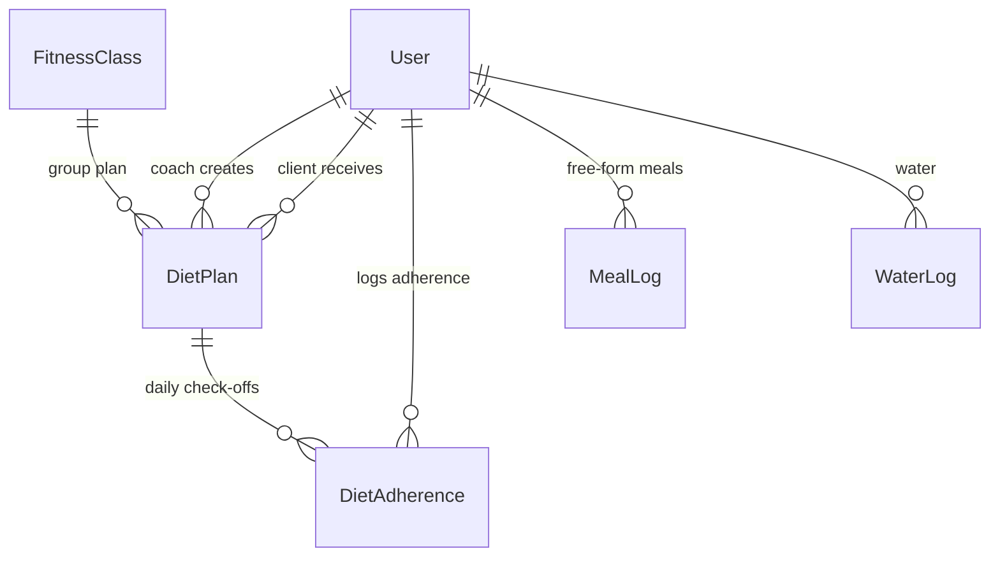
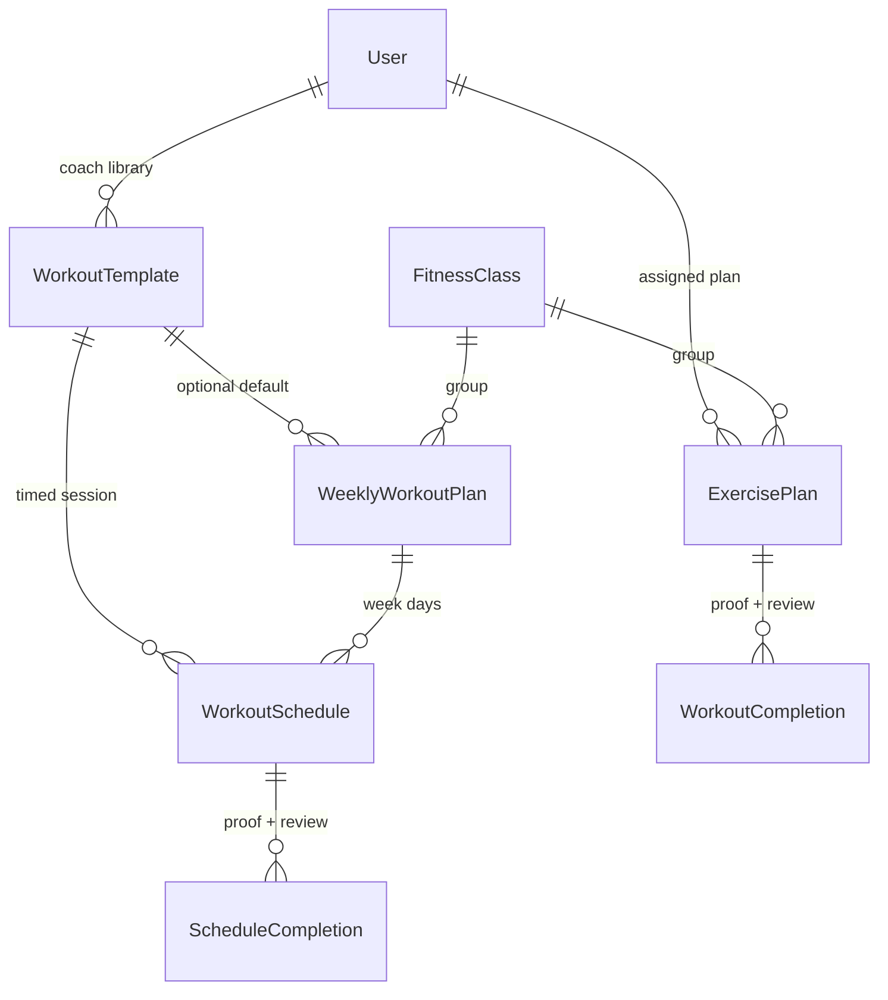
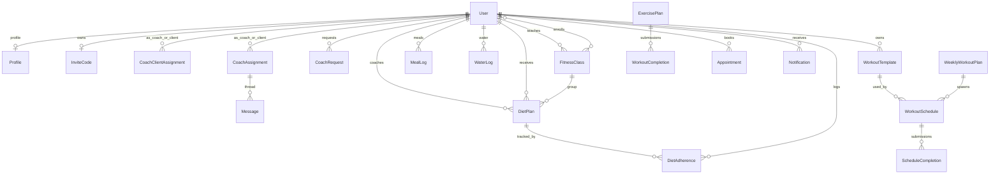

# Database Relationships — Vital Fitness

MongoDB Atlas database: **`vitalguide`**

In MongoDB, “tables” are called **collections**. Each Mongoose model maps to one collection (usually pluralized, e.g. `User` → `users`).

All three clients (mobile, web, backend) share this **one** database.

---

## Big picture



**Rule of thumb:** almost every row points back to a **`User`** (`role`: `admin` | `coach` | `user`).

---

## 1. Users & identity

### `users` (model: `User`)
The main account table.

| Important fields | Meaning |
|------------------|---------|
| `username` | Unique login id |
| `password` | Hashed (not returned by default) |
| `role` | `admin` / `coach` / `user` |
| `status` | `active` / `suspended` / `pending` / `deleted` |
| `full_name`, `phone`, `avatar` | Profile basics (`avatar` = ImageKit URL or old base64) |
| `created_by` → User | Who created this account |
| `invited_by` → User | Who invited them |
| `profile` → Profile | Optional extended profile doc |
| `clientData.assigned_coach_id` → User | Member’s current coach |
| `clientData.*` | age, height, weight, goals, weight_history[] |
| `coachData.*` | coach approval, specialties, max clients, etc. |
| `adminData.*` | admin permissions |

**Relationships**
- User **1 → 0..1** Profile  
- User **1 → 0..1** InviteCode (as owner)  
- User (client) **N → 1** User (coach) via `clientData.assigned_coach_id`

---

### `profiles` (model: `Profile`)
Extended bio / BMI / coach working hours.

- Linked from `User.profile`
- No back-pointer from Profile → User (one-way)

---

### `invitecodes` (model: `InviteCode`)
Share / invite codes.

| Field | Relation |
|-------|----------|
| `owner_id` → User | **1:1** — one code per owner |
| `code` | Unique string |

---

## 2. Coaching graph (how coach & client connect)

There are **three** related structures that stay in sync when a coach request is approved:



### `coachrequests`
Client asks to join a coach (optional class).

| Field | Points to |
|-------|-----------|
| `user` | Member (User) |
| `coach` | Coach (User) |
| `fitnessClass` | Optional FitnessClass |
| `status` | pending / approved / rejected / cancelled |

**Constraint:** only **one pending** request per user (partial unique index).

---

### `coachclientassignments` (modern)
Canonical active coach–client link used for authorization.

| Field | Points to |
|-------|-----------|
| `coach_id` | Coach User |
| `user_id` | Member User |
| `status` | `active` / `ended` |

**Cardinality:** many assignments over time; typically one **active** coach per client.

---

### `coachassignments` (legacy — still required for chat)
Older coach–client container. **Messages** must reference this.

| Field | Points to |
|-------|-----------|
| `user` | Client |
| `coach` | Coach |
| `assignedArticles[]` | Article |
| `customDietPlan` / `customWorkoutPlan` | Embedded text (legacy) |

Controllers often create/update this together with `CoachClientAssignment` and `User.clientData.assigned_coach_id`.

---

### `fitnessclasses`
Group classes taught by a coach.

| Field | Points to |
|-------|-----------|
| `coach` | Coach User |
| `enrolledStudents[]` | Member Users |
| `attendance[].student` | Member Users |

**Diet plans / workout plans** can target either:
- one **client**, **or**
- one **fitnessClass** (group) — not both.

---

### `coachapplications`
User applying to become a coach — **1:1** with User (`user` unique).

### `reviews`
Client rates coach — **unique** `{coach, client}` (one review per pair).

---

## 3. Diet domain



### `dietplans`
Coach-authored meal plan.

| Field | Meaning |
|-------|---------|
| `coach` → User | Author |
| `client` → User **XOR** `fitnessClass` → FitnessClass | Assignee |
| `planType` | `single_day` / `weekly` |
| `meals[]` / `days[].meals[]` | Meal items (type, name, calories, protein, carbs, fats, …) |
| `dailyCalories` | Daily target |
| `status` | draft / active / completed / archived |

---

### `dietadherences`
**One row per user per calendar day** (unique `{user, date}`).

| Field | Meaning |
|-------|---------|
| `user` → User | Who checked meals |
| `coach` → User | Their coach |
| `dietPlan` → DietPlan | Which plan |
| `mealAdherence[]` | `{ type, followed, completedAt }` |
| `caloriesConsumed`, `adherencePercent` | Progress snapshot |
| `dayCompleted` / `followedPlan` | Day fully done |

**How Progress works:** completed meals on this document + plan meal macros → calories / % / nutrition.

---

### `meallogs` & `waterlogs`
Free-form logs by `user` + `date`.  
**Not** ObjectId-linked to `DietPlan`. Progress code joins them by **user + same day** when the plan has no meals.

---

## 4. Workout domain



### Library & plans
| Collection | Role |
|------------|------|
| `workouttemplates` | Reusable coach workouts |
| `weeklyworkoutplans` | Mon–Sun grid (client **XOR** class) |
| `exerciseplans` | Assigned plan (client **XOR** class) |
| `workoutschedules` | Concrete timed session (from template / weekly plan) |
| `workoutplans` | Older simple plan model |
| `sessions` / `schedules` | Older session booking containers |

### Completions (proof photos)
| Collection | Links to | Unique key |
|------------|----------|------------|
| `workoutcompletions` | `exercisePlan` + `user` (+ `coach`) | `{exercisePlan, user}` |
| `schedulecompletions` | `workoutSchedule` + `user` (+ `coach`) | `{workoutSchedule, user}` |

Status flow: `pending` → `pending_review` → `completed` / rejected path via coach review.  
`proofPhoto` stores **ImageKit URL** (or legacy base64).

### `workoutlogs`
Free-form diary; optional `plan_id` → old `WorkoutPlan`.

---

## 5. Progress & activity

| Collection | Key | Relation |
|------------|-----|----------|
| `dailytrackings` | unique `{user_id, date}` | Daily snapshot (water, calories, steps) |
| `activitylogs` | `user` | Logged activities; coach approves (`pending`/`approved`/`rejected`) — coach link is via assignment, not a field |
| `sharecards` | `user_id`, unique `token` | Public share links (expires) |

Progress APIs **compose** data from DietAdherence + MealLog + WaterLog + ActivityLog + completions — not a single “progress” table.

---

## 6. Appointments

### `appointments`
Booked slots between coach and client.

| Fields | Points to |
|--------|-----------|
| `client` / `user_id` | Same member (mirrored names) |
| `coach` / `coach_id` | Same coach (mirrored names) |
| `fitnessClass` | Optional |
| `dateTime` | Slot time |
| `status` | pending / approved / completed / rejected / cancelled / … |

**Index:** unique open slot per coach+time (prevents double booking).

---

## 7. Chat & notifications

### `messages`
| Field | Points to |
|-------|-----------|
| `assignment` | **CoachAssignment** (required thread) |
| `sender`, `receiver` | Users |

No chat without a legacy `CoachAssignment` row.

### `notifications`
| Field | Points to |
|-------|-----------|
| `user` / `recipient_id` | Same recipient (mirrored) |
| `type`, `message`, `data` | Payload |
| `read` | Boolean |

---

## 8. Content & admin

| Collection | Relation |
|------------|----------|
| `articles` | Optional `groups[].students[]` → Users; also linked from `CoachAssignment.assignedArticles` |
| `auditlogs` | `actor_id` → User; `target_id` + `target_type` = polymorphic (any collection) |

---

## Cardinality cheat sheet

| Relationship | Type |
|--------------|------|
| User ↔ Profile | 1 : 0..1 |
| User ↔ InviteCode | 1 : 1 |
| User ↔ CoachApplication | 1 : 1 |
| Coach ↔ Clients (via assignments) | 1 : N |
| Client ↔ Active coach | N : 1 |
| Coach ↔ FitnessClass | 1 : N |
| Class ↔ Students | N : M |
| DietPlan ↔ Assignee | 1 : 1 client **or** 1 : 1 class |
| DietPlan ↔ DietAdherence | 1 : N (many days) |
| User ↔ DietAdherence | 1 : N (one per day) |
| ExercisePlan ↔ WorkoutCompletion | 1 : N (one per user) |
| WorkoutSchedule ↔ ScheduleCompletion | 1 : N (one per user) |
| CoachAssignment ↔ Message | 1 : N |
| Coach ↔ Appointment ↔ Client | N : M through appointments |
| Review coach+client | 1 : 1 unique pair |

---

## XOR pattern (important)

Several plans use **exactly one** target:

```
DietPlan / ExercisePlan / WeeklyWorkoutPlan / WorkoutSchedule
    ├── client → User
    └── OR fitnessClass → FitnessClass
```

Never both. Group plans then fan out to enrolled students (completions created per member).

---

## How domains join in practice

### Diet Progress (example)
1. Resolve active `DietPlan` for user (direct client plan or via class).  
2. Load today’s `DietAdherence` (`user` + `date`).  
3. Sum followed meals’ calories/macros from the plan.  
4. Add `WaterLog` / workouts from other collections.  
5. Return one progress snapshot (not stored as its own table).

### Workout proof (example)
1. Member completes → `WorkoutCompletion` or `ScheduleCompletion`.  
2. Photo → ImageKit → URL in `proofPhoto`.  
3. Coach reviews same row (`status`, `coachFeedback`).

### Chat (example)
1. Need `CoachAssignment` for the pair.  
2. `Message.assignment` = that id.  
3. `sender` / `receiver` = the two Users.

---

## Full ER diagram (core)



---

## Collection list (31)

| Domain | Collections |
|--------|-------------|
| Auth | `users`, `profiles`, `invitecodes` |
| Coaching | `coachapplications`, `coachassignments`, `coachclientassignments`, `coachrequests`, `fitnessclasses`, `reviews` |
| Diet | `dietplans`, `dietadherences`, `meallogs`, `waterlogs` |
| Workouts | `workouttemplates`, `weeklyworkoutplans`, `exerciseplans`, `workoutschedules`, `workoutcompletions`, `schedulecompletions`, `workoutplans`, `workoutlogs`, `sessions`, `schedules` |
| Progress | `dailytrackings`, `activitylogs`, `sharecards` |
| Appointments | `appointments` |
| Chat / system | `messages`, `notifications`, `articles`, `auditlogs` |

---

## Notes for reading Atlas

1. Open database **`vitalguide`**.  
2. Start from a `users` document `_id`.  
3. Find related rows by matching ObjectId fields (`user`, `client`, `coach`, `dietPlan`, …).  
4. Diet progress for a day = `dietadherences` where `user` + `date` match.  
5. Images = URL strings on `users.avatar` / `*.proofPhoto` (ImageKit), not separate image tables.

Model source files: `backend/src/models/*.js`.
